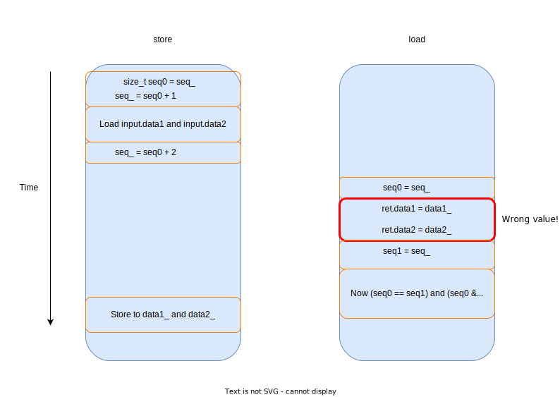
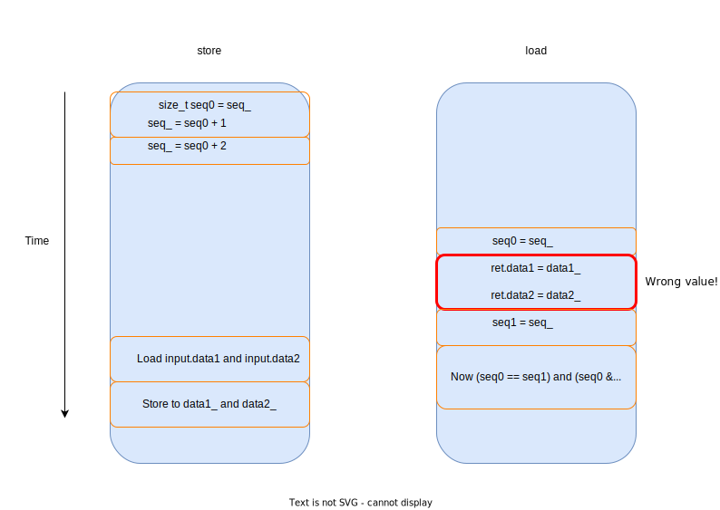

# SeqLock

## Project Overview

This SeqLock is implemented based on the paper "Can Seqlocks Get Along With Programming Language Memory Models? (Hans-J. Boehm)" and references the implementation from [rigtorp/Seqlock](https://github.com/rigtorp/Seqlock?tab=readme-ov-file).

To provide a detailed explanation of the use cases for SeqLock, some background knowledge is necessary.

### Background Knowledge

In the producer-consumer model, the data being pushed can generally be divided into two categories: **state data** and **event data**:

+ **State Data**  
  The consumer only needs to obtain the latest state snapshot.

+ **Event Data**  
  The producer generates events, and each event is pushed to the consumer.

There are also two scenarios for data pushing: **load balancing** and **broadcasting**.

+ **Load Balancing**  
  This is only applicable to scenarios where event data is pushed. Here, consumers balance the load of consuming events and process the corresponding events.

+ **Broadcasting**  
  The data produced by the producer needs to be broadcast to all consumers.

SeqLock is typically used in scenarios where state data is being broadcasted, and we want the consumers' reads to not affect the producer's write latency. In fact, the impact of consumers' reads on the producer is limited to cache coherence and atomic variable updates, with no explicit lock structures.

## Pitfalls in Implementing SeqLock

Here, I summarize the incorrect or suboptimal implementations of SeqLock mentioned in the paper, along with their reasons, to help myself and readers of this project understand.

For ease of demonstration, let's assume the data to be protected is:

```cpp
struct Data
{
    int data1, data2;
};
```

In the `SeqLock` class, we store it as:

```cpp
alignas(Cacheline_Size) int data1_;
int data2_;
std::atomic<size_t> seq_;
```

(The separate storage is also for ease of explanation later.)

Additionally, SeqLock typically has two versions: mp (Multiple-Producer) and sp (Single-Producer). The only difference between the two versions lies in the implementation of `store`. The incorrect or suboptimal implementations shown below are usually only in the `load` implementation, so we will use the sp version of SeqLock for discussion. The mp version is similar.

### Initial Buggy Version: Not Protecting the Non-atomic Data

The initial version is incorrect:

```cpp
template <int Cacheline_Size = 128> 
class SPSeqLockV0
{
public:
    SPSeqLockV0() : seq_(0) {}

    __attribute__((noinline)) Data load() const noexcept
    {
        Data ret;
        size_t seq0, seq1;
        do
        {
            seq0 = seq_; // std::memory_order_seq_cst
            ret.data1 = data1_;
            ret.data2 = data2_;
            seq1 = seq_; // std::memory_order_seq_cst
        } while ((seq0 != seq1) || (seq0 & 1));
        return ret;
    }

    __attribute__((noinline)) void store(const Data & input) noexcept
    {
        size_t seq0 = seq_; // std::memory_order_seq_cst
        seq_ = seq0 + 1; // std::memory_order_seq_cst
        data1_ = input.data1;
        data2_ = input.data2;
        seq_ = seq0 + 2; // std::memory_order_seq_cst
    }

private:
    alignas(Cacheline_Size) int data1_;
    int data2_;
    std::atomic<size_t> seq_;
    std::array<uint8_t, Cacheline_Size - (sizeof(data1_) + sizeof(data2_) + sizeof(seq_)) % Cacheline_Size> padding_;
};
```

This is an incorrect version, and the issues are twofold:

1. **`seq` does not protect `data`**  
   Since `data1_` and `data2_` are not atomic types, the atomicity of `seq` only ensures that `load` and `store` operations on `seq` are atomic. However, it does not guarantee the atomicity of `load` and `store` operations on `data`. A specific counterexample is shown below:

   

2. **The assignment of `data` might be reordered after `seq_ = seq0 + 2`**  
   Due to compiler reordering and CPU out-of-order execution, instructions without dependencies might be reordered. A specific counterexample is shown below:

   
