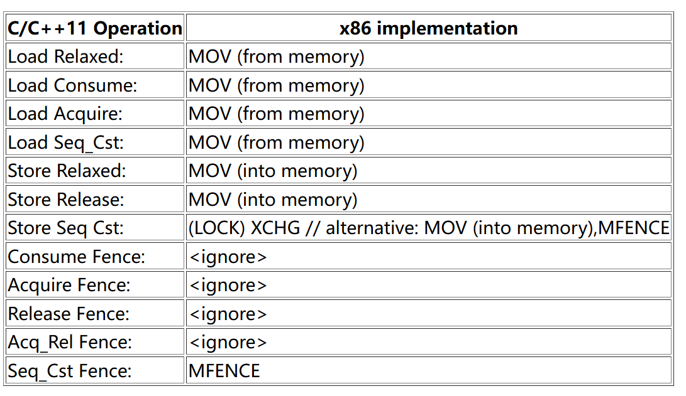

# SeqLock

## Project Overview

This SeqLock is implemented based on the paper "Can Seqlocks Get Along With Programming Language Memory Models? (Hans-J. Boehm)" and references the implementation from [rigtorp/Seqlock](https://github.com/rigtorp/Seqlock?tab=readme-ov-file) (copyright has been noted in the code.). This project is implemented specifically for the x86 platform and may not be compatible with other platforms. Additionally, this documentation is also tailored exclusively for the x86 platform.

To provide a detailed explanation of the use cases for SeqLock, some background knowledge is necessary.

### Background Knowledge

#### What is SeqLock?

In the producer-consumer model, the data being pushed can generally be divided into two categories: **state data** and **event data**:

+ **State Data**  
  The consumer only needs to obtain the latest state snapshot.

+ **Event Data**  
  The producer generates events, and each event is pushed to the consumer.

There are also two scenarios for data pushing: **load balancing** and **broadcasting**.

+ **Load Balancing**  
  This is only applicable to scenarios where event data is pushed. Here, consumers balance the load of consuming events and process the corresponding events.

+ **Broadcasting**  
  The data produced by the producer needs to be broadcast to __all__ consumers.

SeqLock is typically used in scenarios where state data is being broadcasted, and we want the consumers' reads to __not__ affect the producer's write latency. In fact, the impact of consumers' reads on the producer is limited to cache coherence and atomic variable updates, with no explicit lock structures.

#### x86 Memory Order

The memory order on x86 is a relatively strict **Total Store Order (TSO)**, meaning that all CPUs observe a consistent store order. The memory order on x86 can be considered as **sequential consistency** plus a **store buffer (with store forwarding)**.

The **store buffer** is a hardware component commonly found in modern architectures, designed to accelerate memory access. It serves various purposes, such as storing out-of-order store results or speeding up the cache coherence protocol. For example, after a CPU sends an invalidate message, it can write data into the store buffer without waiting for the invalidate ACK, thereby hiding latency.

The requirements for the store buffer on x86 are also quite strict. First, the x86 store buffer does not allow out-of-order store commitments. Second, x86 mandates that all writes to the L1 cache must go through the store buffer. (We can refer to the process of writing data into the store buffer as the **retirement** of a store instruction, and the process of flushing data from the store buffer into the L1 cache as **commitment**.)

We know that modern CPUs use **out-of-order execution** to improve performance. However, they typically implement **in-order retirement** to ensure memory order. Note that **retirement** refers to the process of writing data into the store buffer, at which point the store's value is still not globally visible. It only becomes globally visible after being flushed into the L1 cache through certain mechanisms.

**Store forwarding** optimizes the store-load scenario for a single CPU. If a store to a memory address occurs before a load on the same CPU, and the operand sizes are the same, the load instruction can immediately retrieve the value from the store buffer if it is still present, without waiting for it to be flushed into the L1 cache.

Given these constraints, x86's memory order provides some guarantees: Due to **out-of-order execution**, **in-order retirement**, and the **in-order nature of the store buffer**, **Load-Load**, **Store-Store**, and **Load-Store** operations on a single CPU will not be reordered (from a global visibility perspective). The only scenario where reordering can occur is **Store-Load**, where a store's value has not yet been flushed from the store buffer to the L1 cache, and a subsequent load reads the value. From a global visibility perspective, it appears as if the load occurred before the store.

With this understanding, let's now examine the rules for mapping C++ memory order to assembly instructions on x86: [C/C++11 mappings to processors](https://www.cl.cam.ac.uk/~pes20/cpp/cpp0xmappings.html)



Here, we can surprisingly observe that only `seq_cst` stores are compiled into atomic instructions like `xchg` (short for exchange) or memory barriers. Other memory access instructions are actually compiled into `mov`!

First, we need to understand that, without atomic variables, the compiler can reorder memory access instructions for regular variables. However, memory access for atomic variables, even with the weakest `memory_order_relaxed`, acts as a compiler fence. Through testing, I found that for x86 and GCC, different C++ memory orders can prevent varying degrees of compiler reordering and optimization.

Secondly, due to the guarantees of x86 memory order, `mov` alone can achieve `memory_order_acquire` and `memory_order_release`. For more details, see [C++ How is release-and-acquire achieved on x86 only using MOV?](https://stackoverflow.com/questions/60314179/c-how-is-release-and-acquire-achieved-on-x86-only-using-mov). Note that the semantics of acquire/release are only relevant to the same atomic variable and are significantly weaker than `seq_cst`.

As for `seq_cst` stores, to prevent store-load reordering, we need to use the `xchg` instruction or a memory fence. For the `xchg` instruction, refer to [How does XCHG work in Intel assembly language?](https://stackoverflow.com/questions/50102342/how-does-xchg-work-in-intel-assembly-language). It has an implicit `lock` prefix, which can act as a memory barrier. In my understanding, a full memory barrier on x86 ensures that all contents in the CPU's store buffer are flushed into the L1 cache. `seq_cst` stores are often heavy operations, and the linked resource mentions that the `xchg` instruction takes approximately 20 cycles.

From my personal experience, when doing lock-free programming, it's crucial to examine the assembly instructions corresponding to the code. The C++ standard can be quite obscure, especially when multiple memory orders are mixed. Reading the rules on cppreference can be mentally exhausting. In such cases, looking at the assembly instructions and combining them with x86's memory order rules makes it much easier to understand the correct implementation.

## Implementing SeqLock Step by Step

In this section, I combine insights from the original paper to implement an optimal and correct SeqLock step by step. Due to the characteristics of x86 memory order, the explanation here will differ slightly from the original paper.

For ease of demonstration, let's assume the data to be protected is:

```cpp
struct Data
{
    int data1, data2;
};
```

In the `SeqLock` class, we store it as:

```cpp
alignas(Cacheline_Size) int data1_;
int data2_;
std::atomic<size_t> seq_;
```

(The separate storage is also for ease of explanation later.)

Additionally, SeqLock typically has two versions: mp (Multiple-Producer) and sp (Single-Producer). The only difference between the two versions mainly lies in the implementation of `store`. The suboptimal implementations shown below are usually only in the `load` implementation, so we will use the sp version of SeqLock for discussion. The mp version is similar.

### Initial Version: Using seq_cst store

The initial implementation is correct for the x86 architecture under a single-producer scenario, but it is not performance-optimized:

(The original paper points out that this version is incorrect in the context of general hardware architectures' memory order. However, due to x86's strict memory order, it does not fail in this case.)

```cpp
template <int Cacheline_Size = 64>
class SPSeqLockV0
{
public:
    SPSeqLockV0() : seq_(0) {}

    __attribute__((noinline)) Data load() const noexcept
    {
        Data ret;
        size_t seq0, seq1;
        do
        {
            seq0 = seq_; // std::memory_order_seq_cst
            ret.data1 = data1_;
            ret.data2 = data2_;
            seq1 = seq_; // std::memory_order_seq_cst
        } while ((seq0 != seq1) || (seq0 & 1));
        return ret;
    }

    __attribute__((noinline)) void store(const Data & input) noexcept
    {
        size_t seq0 = seq_; // std::memory_order_seq_cst
        seq_ = seq0 + 1; // std::memory_order_seq_cst
        data1_ = input.data1;
        data2_ = input.data2;
        seq_ = seq0 + 2; // std::memory_order_seq_cst
    }

private:
    alignas(Cacheline_Size) int data1_;
    int data2_;
    std::atomic<size_t> seq_;
    std::array<uint8_t, Cacheline_Size - (sizeof(data1_) + sizeof(data2_) + sizeof(seq_)) % Cacheline_Size> padding_;
};
```

Let's dive directly into the assembly. Under the x86 GCC (-O3) environment, the compiled assembly instructions for this program can be found at [Compiler Explorer: v0](https://godbolt.org/z/r77WE4bhT). A snippet is shown below:

```asm
SPSeqLock<128>::load() const:
        lea     rcx, [rdi+8] ;rcx : address of seq_ (rdi contains 'this')
.L3:    ;loop
        mov     rsi, QWORD PTR [rcx] ;seq0 = seq_ 
        mov     eax, DWORD PTR [rdi] ;eax = data_1
        mov     r8d, DWORD PTR [rdi+4] ;eax = data_2
        mov     rdx, QWORD PTR [rcx] ;seq0 = seq_
        cmp     rdx, rsi    ;seq0 == seq1 ?
        jne     .L3
        and     edx, 1      ;seq0 & 1 ?
        jne     .L3
        movd    xmm0, eax   ;pack the struct as return result
        movd    xmm1, r8d
        punpckldq       xmm0, xmm1
        movq    rax, xmm0
        ret
SPSeqLock<128>::store(Data const&):
        lea     rdx, [rdi+8]    ;rdx : address of seq_
        mov     rax, QWORD PTR [rdi+8]  ;rax = seq_
        lea     rcx, [rax+1]    ;seq0 = seq_ + 1
        xchg    rcx, QWORD PTR [rdx] ;seq_ = seq_ + 1 (atomic)
        mov     ecx, DWORD PTR [rsi] ;ecx = data1
        mov     DWORD PTR [rdi], ecx   ;data1_ = data1
        mov     ecx, DWORD PTR [rsi+4]  ;ecx = data2
        add     rax, 2  ;rax = seq0 + 2
        mov     DWORD PTR [rdi+4], ecx  ;data2_ = data2
        xchg    rax, QWORD PTR [rdx] ;seq_ = seq0 + 2
        ret
```

It can be observed that the compiler did not reorder the memory instructions within the `load` and `store` functions. Here, the `store` function uses the atomic instruction `xchg` to store into `seq_`.

To gain a deeper understanding of what `atomic` and `memory_order_seq_cst` are doing here, let's take a look at what the compiled code would look like if we remove the `atomic` from `seq_`:
[Compiler Explorer: no atomic](https://godbolt.org/z/ee3aqeKvY)

A snippet is shown below:

```asm
SPSeqLock<128>::load() const (.isra.0):
        and     edx, 1 ;seq0 & 1
        je      .L2   
.L3:
        jmp     .L3   ;infinite loop
.L2:
        movd    xmm0, edi    ;pack the struct as return result
        movd    xmm1, esi
        punpckldq       xmm0, xmm1
        movq    rax, xmm0
        ret
SPSeqLock<128>::store(Data const&):
        mov     eax, DWORD PTR [rsi]    ;eax = data1
        mov     DWORD PTR [rdi], eax    ;data1_ = data1
        mov     eax, DWORD PTR [rsi+4]  ;eax = data2
        add     QWORD PTR [rdi+8], 2    ;seq_ = seq_ + 2
        mov     DWORD PTR [rdi+4], eax  ;data2_ = data2
        ret
```

We can observe that without `atomic`, the compiler performs aggressive optimizations: In the `load` function, the compiler assumes that `seq_` has not been modified, so `seq0` and `seq1` must be equal, and it only needs to directly check the result of `(seq_ & 1)`. In the `store` function, the compiler eliminates the assignment `seq_ = seq0 + 1` and reorders the store instructions for `data2_ = input.data2` and `seq_ = seq0 + 2`.

Therefore, by making `seq_` an atomic variable, we can avoid the compiler's optimizations mentioned here: store instructions will not be reordered, and loads of `seq_` will not be eliminated by the compiler. Additionally, since the default `seq_cst` memory order is used here, our store instruction for `seq_` will still be the atomic instruction `xchg`, which acts as a memory barrier.

Why is this version, which only makes `seq_` an atomic variable and uses `seq_cst` memory order, correct? We can see that `data1_` and `data2_` are not atomic variables, nor are they explicitly protected by memory fences.

The answer lies in x86's strict memory order. Note that the consumer's read is only valid when the producer has executed the second `xchg` instruction and has not yet executed the next `xchg` instruction. The `xchg` instruction is a full memory barrier—it locks the memory and cache bus and flushes the store buffer. We observe that when the consumer performs a valid read, `data1_` and `data2_` must have already been committed from the store buffer to the L1 cache. Therefore, the data read by the consumer will not be problematic.

Can we further optimize this implementation? The answer is yes!

### Actually, `xchg` is Not Necessary

Can we avoid using the heavy `xchg` instruction? Let's consider the following implementation:

```cpp
template <int Cacheline_Size = 64>
class SPSeqLockV1
{
public:
    SPSeqLockV1() : seq_(0) {}

    __attribute__((noinline)) Data load() const noexcept
    {
        Data ret;
        size_t seq0, seq1;
        do
        {
            seq0 = seq_.load(std::memory_order_acquire);
            ret.data1 = data1_;
            ret.data2 = data2_;
            seq1 = seq_.load(std::memory_order_acquire);
        } while ((seq0 != seq1) || (seq0 & 1));
        return ret;
    }

    __attribute__((noinline)) void store(const Data & input) noexcept
    {
        size_t seq0 = seq_.load(std::memory_order_relaxed); 
        seq_.store(seq0 + 1, std::memory_order_release);
        data1_ = input.data1;
        data2_ = input.data2;
        seq_.store(seq0 + 2, std::memory_order_release);
    }

private:
    alignas(Cacheline_Size) int data1_;
    int data2_;
    std::atomic<size_t> seq_;
    std::array<uint8_t, Cacheline_Size - (sizeof(data1_) + sizeof(data2_) + sizeof(seq_)) % Cacheline_Size> padding_;
};
```

The corresponding assembly can be found at [SeqLock without xchg](https://godbolt.org/z/6occ4rEWP).

An excerpt is shown below:

```asm
SPSeqLock<64>::load() const:
        lea     rcx, [rdi+8]
.L3:
        mov     rsi, QWORD PTR [rcx] ;load seq_
        mov     eax, DWORD PTR [rdi]    ;load data1_
        mov     r8d, DWORD PTR [rdi+4]  ;load data2_
        mov     rdx, QWORD PTR [rcx] ;load seq_
        cmp     rdx, rsi
        jne     .L3
        and     edx, 1
        jne     .L3
        movd    xmm0, eax
        movd    xmm1, r8d
        punpckldq       xmm0, xmm1
        movq    rax, xmm0
        ret
SPSeqLock<64>::store(Data const&):
        mov     rax, QWORD PTR [rdi+8]
        lea     rdx, [rax+1]
        add     rax, 2
        mov     QWORD PTR [rdi+8], rdx ;store seq_
        mov     edx, DWORD PTR [rsi]    
        mov     DWORD PTR [rdi], edx    ;store data1_
        mov     edx, DWORD PTR [rsi+4]
        mov     DWORD PTR [rdi+4], edx  ;store data2_
        mov     QWORD PTR [rdi+8], rax ;store seq_
        ret
```

This implementation is also correct. On x86, store-store reordering does not occur. If the consumer observes the producer's second `seq_.store`, it must also observe the stores to `data1_` and `data2_`. Therefore, even if `seq_.store` does not forcibly flush the store buffer, the store order is still guaranteed. Additionally, this version performs better than the first one because it eliminates the `LOCK` instruction (`xchg`).

However, note that although `std::memory_order_acquire/release` and `std::memory_order_relaxed` are both compiled into `mov` on x86, they have different semantics. As a result, the compiler performs different optimizations (such as reordering) based on these semantics. Let's see what happens if we change all memory orders here to `relaxed`.

See [Seqlock_with_relaxed_memory_order](https://godbolt.org/z/jjYr71s57). An excerpt of the assembly is shown below:

```asm
SPSeqLock<64>::load() const:
        mov     eax, DWORD PTR [rdi] ;load data1_
        lea     rcx, [rdi+8]
        mov     edi, DWORD PTR [rdi+4]  ;load data2_
.L3:
        mov     rsi, QWORD PTR [rcx]  ;load seq_
        mov     rdx, QWORD PTR [rcx]  ;load seq_
        cmp     rdx, rsi
        jne     .L3
        and     edx, 1
        jne     .L3
        movd    xmm0, eax
        movd    xmm1, edi
        punpckldq       xmm0, xmm1
        movq    rax, xmm0
        ret
SPSeqLock<64>::store(Data const&):
        mov     rax, QWORD PTR [rdi+8]
        lea     rdx, [rax+1]
        add     rax, 2
        mov     QWORD PTR [rdi+8], rdx ;store seq_
        mov     edx, DWORD PTR [rsi]
        mov     DWORD PTR [rdi], edx    ;store data1_
        mov     edx, DWORD PTR [rsi+4] 
        mov     DWORD PTR [rdi+4], edx  ;store data2_
        mov     QWORD PTR [rdi+8], rax ;store seq_
        ret
```

We can see that, due to the weak semantics of `std::memory_order_relaxed`, the compiler has reordered instructions in the `load` function! Therefore, this implementation is incorrect.

### What Happens if We Add a Memory Fence?

We have already implemented a high-performance and correct version. However, many open-source `SeqLock` implementations use memory fences. Let's see how adding a memory fence would compile into assembly.

For this implementation:

```cpp
template <int Cacheline_Size = 64>
class SPSeqLockV2
{
public:
    SPSeqLockV2() : seq_(0) {}

    __attribute__((noinline)) Data load() const noexcept
    {
        Data ret;
        size_t seq0, seq1;
        do
        {
            seq0 = seq_.load(std::memory_order_acquire);
            std::atomic_signal_fence(std::memory_order_acq_rel);
            ret.data1 = data1_;
            ret.data2 = data2_;
            std::atomic_signal_fence(std::memory_order_acq_rel);
            seq1 = seq_.load(std::memory_order_acquire);
        } while ((seq0 != seq1) || (seq0 & 1));
        return ret;
    }

    __attribute__((noinline)) void store(const Data & input) noexcept
    {
        size_t seq0 = seq_.load(std::memory_order_relaxed); 
        seq_.store(seq0 + 1, std::memory_order_release);
        std::atomic_signal_fence(std::memory_order_acq_rel);
        data1_ = input.data1;
        data2_ = input.data2;
        std::atomic_signal_fence(std::memory_order_acq_rel);
        seq_.store(seq0 + 2, std::memory_order_release);
    }

private:
    alignas(Cacheline_Size) int data1_;
    int data2_;
    std::atomic<size_t> seq_;
    std::array<uint8_t, Cacheline_Size - (sizeof(data1_) + sizeof(data2_) + sizeof(seq_)) % Cacheline_Size> padding_;
};
```

The assembly can be found at [SeqLock with memory fence](https://godbolt.org/z/nx3bh6WsK). An excerpt is shown below:

```asm
SPSeqLock<64>::load() const:
        lea     rcx, [rdi+8]
.L3:
        mov     rsi, QWORD PTR [rcx]
        mov     eax, DWORD PTR [rdi]
        mov     r8d, DWORD PTR [rdi+4]
        mov     rdx, QWORD PTR [rcx]
        cmp     rdx, rsi
        jne     .L3
        and     edx, 1
        jne     .L3
        movd    xmm0, eax
        movd    xmm1, r8d
        punpckldq       xmm0, xmm1
        movq    rax, xmm0
        ret
SPSeqLock<64>::store(Data const&):
        mov     rax, QWORD PTR [rdi+8]
        lea     rdx, [rax+1]
        add     rax, 2
        mov     QWORD PTR [rdi+8], rdx
        mov     edx, DWORD PTR [rsi]
        mov     DWORD PTR [rdi], edx
        mov     edx, DWORD PTR [rsi+4]
        mov     DWORD PTR [rdi+4], edx
        mov     QWORD PTR [rdi+8], rax
        ret
```

We can surprisingly observe that adding `std::atomic_signal_fence(std::memory_order_acq_rel);` does not change the assembly! No `mfence` instruction or `xchg` instruction is inserted. This might be because the compiler has already determined that the `memory_order` semantics can be satisfied without adding these instructions, so for performance reasons, the compiler does not insert additional instructions. Here, we can still choose to keep `std::atomic_signal_fence` in the code to serve as a semantic annotation.

### Finalizing as a Template Class

To accommodate different types that need protection, we finally modify `SeqLock` into a template class, completing the implementation. This is the Single-Producer version:

```cpp
template <CopyableT T, int Cacheline_Size = 64> 
class SPSeqLock
{
public:
    SPSeqLock() : seq_(0) {}

    __attribute__((noinline)) T load() const noexcept
    {
        T ret;
        size_t seq0, seq1;
        do
        {
            seq0 = seq_.load(std::memory_order_acquire);
            std::atomic_signal_fence(std::memory_order_acq_rel);
            ret = value_;
            std::atomic_signal_fence(std::memory_order_acq_rel);
            seq1 = seq_.load(std::memory_order_acquire);
        } while ((seq0 != seq1) || (seq0 & 1));
        return ret;
    }

    __attribute__((noinline)) void store(const T & input) noexcept
    {
        size_t seq0 = seq_.load(std::memory_order_relaxed);
        seq_.store(seq0 + 1, std::memory_order_release);
        std::atomic_signal_fence(std::memory_order_acq_rel);
        value_ = input;
        std::atomic_signal_fence(std::memory_order_acq_rel);
        seq_.store(seq0 + 2, std::memory_order_release);
    }

private:
    alignas(Cacheline_Size) T value_;
    std::atomic<size_t> seq_;
    std::array<uint8_t, Cacheline_Size - (sizeof(value_) + sizeof(seq_)) % Cacheline_Size> padding_;
};
```

And this is the Multi-Producer version:

```cpp
template <CopyableT T, int Cacheline_Size = 64> 
class MPSeqLock
{
public:
    MPSeqLock() : seq_(0) {}

    __attribute__((noinline)) T load() const noexcept
    {
        T ret;
        size_t seq0, seq1;
        do
        {
            seq0 = seq_.load(std::memory_order_acquire);
            std::atomic_signal_fence(std::memory_order_acq_rel);
            ret = value_;
            std::atomic_signal_fence(std::memory_order_acq_rel);
            seq1 = seq_.load(std::memory_order_relaxed);
        } while ((seq0 != seq1) || (seq0 & 1));
        return ret;
    }

    __attribute__((noinline)) void store(const T & input) noexcept
    {
        size_t seq0 = seq_.load(std::memory_order_relaxed);
        while((seq0 & 1) || (!seq_.compare_exchange_weak(seq0, seq0 + 1))) {}
        std::atomic_signal_fence(std::memory_order_acq_rel);
        value_ = input;
        std::atomic_signal_fence(std::memory_order_acq_rel);
        seq_.store(seq0 + 2, std::memory_order_release);
    }

private:
    alignas(Cacheline_Size) T value_;
    std::atomic<size_t> seq_;
    std::array<uint8_t, Cacheline_Size - (sizeof(value_) + sizeof(seq_)) % Cacheline_Size> padding_;
};
```

The only difference in the Multi-Producer version is that the `store` function needs to use `CAS` (Compare-And-Swap) to avoid writer collisions.

With this, we have fully implemented this `Seqlock` and gained extensive knowledge about modern architectures, compilers, lock-free programming, and memory ordering.

## References

[Hardware Memory Models](https://research.swtch.com/hwmm)

[Programming Language Memory Models](https://research.swtch.com/plmm)

[Memory Barriers: a Hardware View for Software Hackers](http://www.rdrop.com/users/paulmck/scalability/paper/whymb.2010.07.23a.pdf)

[Memory model synchronization modes](https://gcc.gnu.org/wiki/Atomic/GCCMM/AtomicSync)

[Are memory barriers needed because of cpu out of order execution or because of cache consistency problem?](https://stackoverflow.com/questions/63970362/are-memory-barriers-needed-because-of-cpu-out-of-order-execution-or-because-of-c)

[How is load->store reordering possible with in-order commit?](https://stackoverflow.com/questions/52215031/how-is-load-store-reordering-possible-with-in-order-commit)

[C/C++11 mappings to processors](https://www.cl.cam.ac.uk/~pes20/cpp/cpp0xmappings.html)