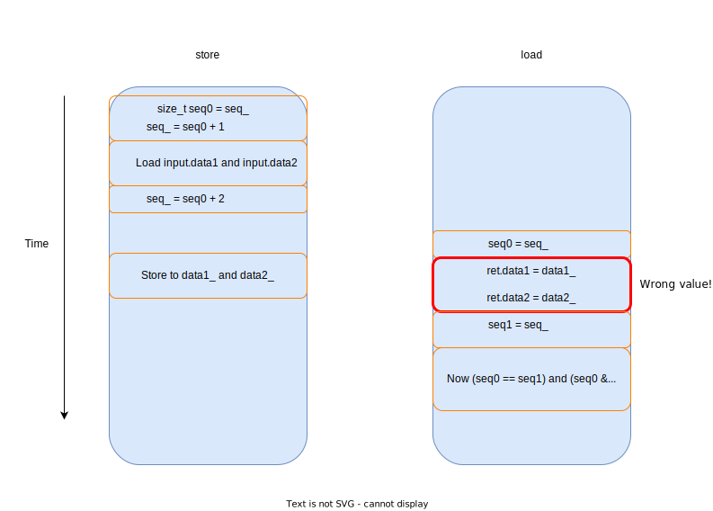
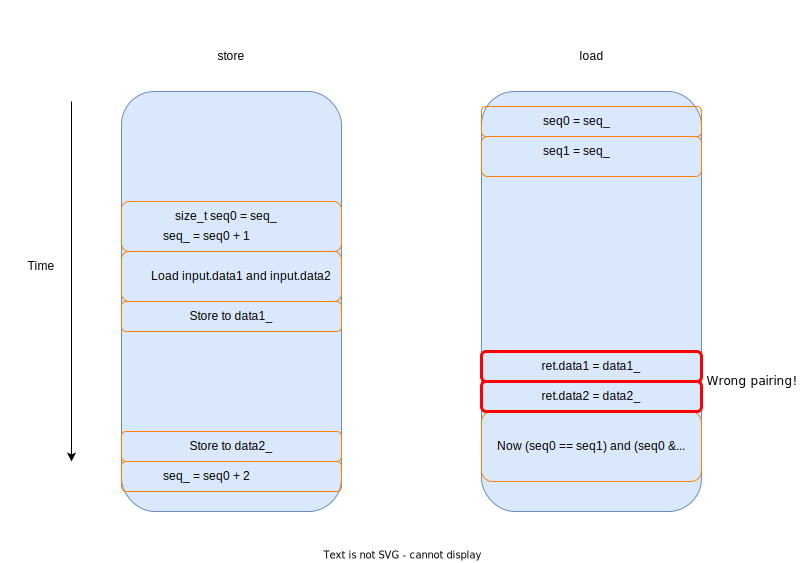

# SeqLock

## Project Overview

This SeqLock is implemented based on the paper "Can Seqlocks Get Along With Programming Language Memory Models? (Hans-J. Boehm)" and references the implementation from [rigtorp/Seqlock](https://github.com/rigtorp/Seqlock?tab=readme-ov-file).

To provide a detailed explanation of the use cases for SeqLock, some background knowledge is necessary.

### Background Knowledge

In the producer-consumer model, the data being pushed can generally be divided into two categories: **state data** and **event data**:

+ **State Data**  
  The consumer only needs to obtain the latest state snapshot.

+ **Event Data**  
  The producer generates events, and each event is pushed to the consumer.

There are also two scenarios for data pushing: **load balancing** and **broadcasting**.

+ **Load Balancing**  
  This is only applicable to scenarios where event data is pushed. Here, consumers balance the load of consuming events and process the corresponding events.

+ **Broadcasting**  
  The data produced by the producer needs to be broadcast to __all__ consumers.

SeqLock is typically used in scenarios where state data is being broadcasted, and we want the consumers' reads to __not__ affect the producer's write latency. In fact, the impact of consumers' reads on the producer is limited to cache coherence and atomic variable updates, with no explicit lock structures.

## Pitfalls in Implementing SeqLock

Here, I summarize the incorrect or suboptimal implementations of SeqLock mentioned in the paper, along with their reasons, to help myself and readers of this project understand.

For ease of demonstration, let's assume the data to be protected is:

```cpp
struct Data
{
    int data1, data2;
};
```

In the `SeqLock` class, we store it as:

```cpp
alignas(Cacheline_Size) int data1_;
int data2_;
std::atomic<size_t> seq_;
```

(The separate storage is also for ease of explanation later.)

Additionally, SeqLock typically has two versions: mp (Multiple-Producer) and sp (Single-Producer). The only difference between the two versions lies in the implementation of `store`. The incorrect or suboptimal implementations shown below are usually only in the `load` implementation, so we will use the sp version of SeqLock for discussion. The mp version is similar.

### Initial Buggy Version (Version 0): Not Protecting the Non-atomic Data

The initial version is incorrect:

```cpp
template <int Cacheline_Size = 128> 
class SPSeqLockV0
{
public:
    SPSeqLockV0() : seq_(0) {}

    __attribute__((noinline)) Data load() const noexcept
    {
        Data ret;
        size_t seq0, seq1;
        do
        {
            seq0 = seq_; // std::memory_order_seq_cst
            ret.data1 = data1_;
            ret.data2 = data2_;
            seq1 = seq_; // std::memory_order_seq_cst
        } while ((seq0 != seq1) || (seq0 & 1));
        return ret;
    }

    __attribute__((noinline)) void store(const Data & input) noexcept
    {
        size_t seq0 = seq_; // std::memory_order_seq_cst
        seq_ = seq0 + 1; // std::memory_order_seq_cst
        data1_ = input.data1;
        data2_ = input.data2;
        seq_ = seq0 + 2; // std::memory_order_seq_cst
    }

private:
    alignas(Cacheline_Size) int data1_;
    int data2_;
    std::atomic<size_t> seq_;
    std::array<uint8_t, Cacheline_Size - (sizeof(data1_) + sizeof(data2_) + sizeof(seq_)) % Cacheline_Size> padding_;
};
```

This is an incorrect version, and the issues are twofold:

1. **The instructions might be reordered**
   
   Due to compiler reordering and CPU out-of-order execution, instructions without dependencies might be reordered. 

2. **`seq` does not protect `data`**  

   Since `data1_` and `data2_` are not atomic types, the atomicity of `seq` only ensures that `load` and `store` operations on `seq` are atomic. However, it does not guarantee the atomicity of `load` and `store` operations on `data`. 
   
A specific counterexample is shown below:



### Simple Fix (Version 1): Add Atomic

A simple solution is to change the `data1_` and `data2_` stored in `SeqLock` to atomic variables:

```cpp
alignas(Cacheline_Size) std::atomic<int> data1_;
std::atomic<int> data2_;
std::atomic<size_t> seq_;
```

No other parts need modification. This uses `std::memory_order_seq_cst` by default, which, as the name suggests, ensures strict ordering for each atomic operation. This guarantees correctness.

However, this implementation has some issues in terms of practicality and performance:

+ Practicality

To make it a general-purpose class, we will eventually need to write `SeqLock` with template parameters. In that case, we won't be able to store atomic variables directly in the class as we do now.

+ Performance

Using `std::memory_order_seq_cst` for all atomic operations is too conservative. In many places, we don't need such strict memory ordering.

For example, for the following:


```cpp
ret.data1 = data1_; // std::memory_order_seq_cst
ret.data2 = data2_; // std::memory_order_seq_cst
```

We only need these two atomic operations to be ordered as a whole, in relation to the atomic operations before and after them, but we don't need strict ordering between them. The strict memory order here prevents the compiler and CPU from optimizing reordering, which negatively impacts performance.

### Incorrect Fix (Version 2): Using relaxed atomics

We could try changing these two atomic operations to use `std::memory_order_relaxed`

```cpp
ret.data1 = data1_.load(std::memory_order_relaxed); 
ret.data2 = data2_.load(std::memory_order_relaxed); 
```

For details on C++ memory order, see [cppreference:memory_order](https://en.cppreference.com/w/cpp/atomic/memory_order)

As mentioned in cppreference:

```
Relaxed operation: there are no synchronization or ordering constraints imposed on other reads or writes, only this operation's atomicity is guaranteed.
```

This explains why Version 2 is an incorrect implementation: the load instructions for data1_ and data2_ can be reordered with the load instruction for seq_, causing the returned data to be mismatched (part old data and part new data). However, since atomic variables are used, no data corruption will occur.

